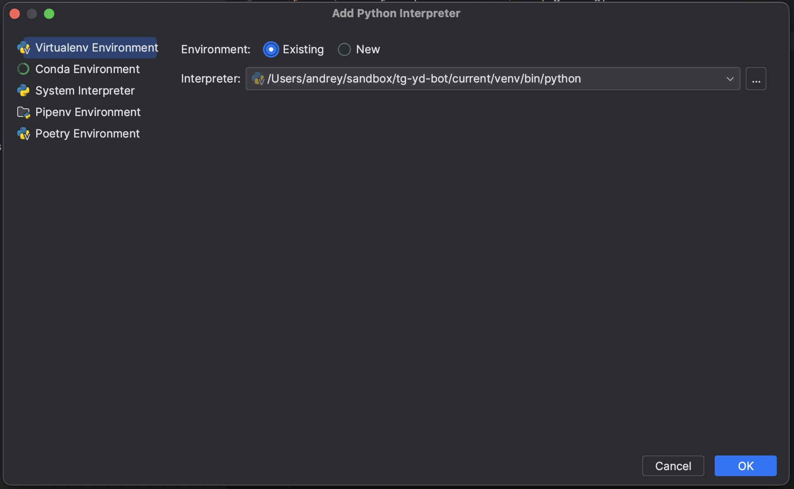

# tg-yd-bot


**tg-yd-bot** - simple Telegram bot, which just resend your files from the Telegram chat with bot to selected Yandex.Disk folder. You can use it both from host or from the Docker. Feel free to send any requests about it.

When sending or forwarding photos & documents in chat with bot, it will save all to [Yandex Disk](https://360.yandex.ru/disk/) in a folder
(by default "bot_uploads" but you can set your own YANDEX_FOLDER for it). The bot accepts files from specific users by checking their Telegram ids.
For users whose ids are not specified, the bot will not show any activity. This project made from [cloud-saving-bot](https://github.com/nsat1/cloud-saving-bot) from [Artem Nasakin](https://github.com/nsat1)

[](Python)

## Contents

- [Environment variables](#environment-variables)
- [Environments support](#environments-support)
- [Paths and volumes](#paths-and-volumes)
- [How to use](#how-to-use)
    - [Direct on host](#direct-on-host)
      - [Automatic build on host](#automatic-build-on-host)
      - [Automatic run on host](#automatic-run-at-host)
      - [Manual build on host](#manual-build-on-host)
      - [Manual run on the host](#manual-run-on-host)
    - [On Docker](#on-docker)
      - [Build on Docker](#build-on-docker)
      - [Run on Docker](#run-on-docker)
    - [Using systemd](#using-systemd)
- [Configure virtualenv in PyCharm](#configure-virtualenv-in-pycharm)
- [License](#license)
- [Credits](#credits)
- [References and materials](#references-and-materials)

## Environment variables

|      Name     |                                                    Description                                                     |
|:-------------:|:------------------------------------------------------------------------------------------------------------------:|
| BOT_TOKEN     | Telegram bot API token. You can get it from [@BotFather](https://telegram.me/BotFather)                            |
| YANDEX_TOKEN  | Yandex Disk API token. Get it from this [link](https://yandex.ru/dev/disk-api/doc/ru/concepts/quickstart#oauth)    |
| ALLOWED_IDS   | This is the telegram id of users from whom the bot will successfully accept photos. Example in `.env.example` file |
| YANDEX_FOLDER | Folder, which should be placed uploaded files.                                                                     |

## Environments support
The list of environments in which the system has been tested is described below.

- MacOS 13.6.3 (```arm64v8```)
- Ubuntu 24.04 LTS (```amd64```)

## Paths and volumes

- Project path: /home/admin/tg-yd-bot/current

## How to use

Copy env from example.
```bash
cp .env.example .env
```
Configure environment variables in `.env` file.

### Direct on host

#### Automatic build on host

```bash
./build.sh
```

#### Automatic run at host

```bash
./run.sh
```

#### Manual build on host

1. Install python and virtualenv.
```bash
brew install python3
pip install virtualenv
```

2. Create virtualenv "venv"

```bash
virtualenv venv
virtualenv -p python3.13 venv
```

3. Switch to virtualenv "venv"
```bash
source venv/bin/activate
```

4. Install packages
```bash
poetry install
```
#### Manual run on host

Running server
```bash
poetry run server
```
After finished you can exit from virtualenv.

Deactivate virtualenv "venv"
```bash
deactivate
```

### On Docker

#### Build on Docker

```bash
dcoker compose build
```

#### Run on Docker

```bash
docker compose up
```

### Using systemd

Systemd Unit-file located at ```tg-yd-bot.service```. Copy it to the ```/etc/systemd/system``` and run:
```bash
sudo systemctl daemon-reload
sudo systemctl enable tg-yd-bot
sudo systemctl start tg-yd-bot
```

### Using for VSCode
For the best experience, you can use VSCode with Python extension. In this way please install extensionms:

```bash
pip install aiogram
pip install python-dotenv
pip install yadisk
```

### Configure virtualenv in PyCharm



### License

Distributed under MIT license. See [LICENSE](./LICENSE) for more information.

### Credits
- This project inspired by [cloud-saving-bot](https://github.com/nsat1/cloud-saving-bot) from [Artem Nasakin](https://github.com/nsat1).
- Refactoring and fixes by [Andrei Tokarchuk](https://github.com/netandreus).

### References and materials
- [cloud-saving-bot](https://github.com/nsat1/cloud-saving-bot)
- [Создание виртуальных окружений и установка библиотек для Python 3 в IDE PyCharm](https://habr.com/ru/articles/491916/)